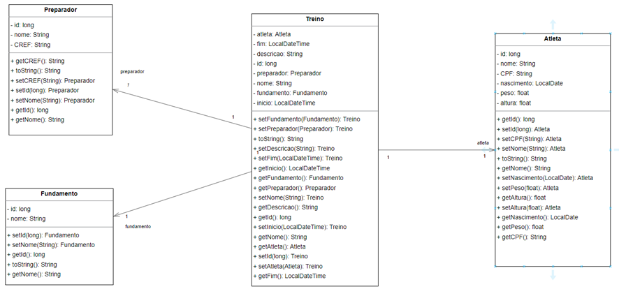
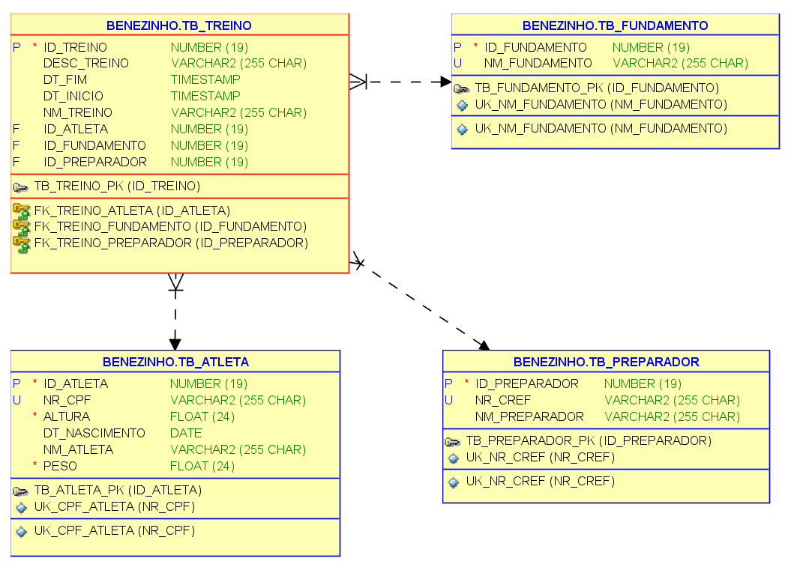

# Benezinho Bom de Bola 🤓👍🏾

Checkpoint I - Enterprise Application Development aplicada em 29/03/2023.

|                | **Enterprise Application Development** |
|------------------------------------------|----------------------------------------|
| **ALUNO:**                               | **TURMA:** 2TDSPI  - 2TDSPJ            |
| **PROFESSOR:** Benefrancis do Nascimento | 29/03/2023                             |
| **CHECK POINT 1**                        | **VALE 10 PONTOS**                     |

# Sumário

[Estudo de caso ](#_Estudo_de_caso)

[O que deverá ser feito? ](#_O_que_devera_ser_feito)

[Diagrama de Classes ](#_Diagrama_de_Classes)

[Correção da Prova ](#_Correcao)

<a id="_Estudo_de_caso"></a>

# Estudo de caso

O futebol é considerado uma paixão nacional no Brasil e tem um grande impacto social. Além de ser uma atividade de lazer
e um espetáculo esportivo, o futebol também tem o potencial de ajudar a combater a pobreza e a violência, especialmente
nas comunidades carentes.

Projetos sociais que usam o esporte como ferramenta educativa e de inclusão social têm um papel fundamental nesse
processo, oferecendo oportunidades para que crianças e jovens aprendam valores importantes, desenvolvam habilidades
físicas e mentais e tenham acesso a uma educação melhor e um futuro mais promissor.

Além disso, o futebol pode ser uma ferramenta importante na luta contra a discriminação, o racismo e a homofobia.
Torcidas organizadas e jogadores famosos têm se mobilizado para combater essas práticas e promover a diversidade nos
estádios. Em suma, o futebol tem um grande potencial como agente de transformação social no Brasil, e pode ajudar a
formar cidadãos mais conscientes e engajados, além de promover a diversidade e a inclusão na sociedade em geral.

O fictício projeto social BBB (Benezinho Bom de Bola 🤓👍🏾) tem ganhado muita notoriedade nos últimos anos e como projeto
deste ano, decidimos utilizar ferramentas tecnológicas para melhoria dos treinos dos atletas. Contratamos você e uma
equipe de Arquitetos de Software para projetar e construir um sistema capaz de registrar planos de treinos para os
atletas. Com esse sistema, será possível fazer medições da evolução técnica e tática dos atletas que fazem parte do
projeto social.

<a id="_O_que_devera_ser_feito"></a>

# O que deverá ser feito?

Na sprint atual, você foi incumbido de fazer:

1. O Mapeamento Objeto Relacional das primeiras classes envolvidas neste projeto de software;
2. A criação automatizada das tabelas no banco de dados Oracle;
3. A persistência dos dados;
4. A criação de dois métodos capazes de realizar consultas aos dados persistidos previamente. Veja
   o [Diagrama de Classes ](#_Diagrama_de_Classes) (as classes já foram criadas):

**Importe o projeto do github :**

https://github.com/Benefrancis/benezinho-bom-de-bola.git

Caso o github esteja indisponível, você deverá pegar o projeto no diretório compartilhado.

**Você deverá:**

1. **(0,5 Ponto)** acessar o arquivo persistence.xml e alterar as configurações da **persistence-unit** para que seja
   possível conectar-se ao banco de dados Oracle da FIAP com o seu usuário e senha (manter o seu usuário e senha ativo é
   sua responsabilidade). Não utilize o usuário e senha de outro aluno. Caso tenha problema para autenticar, comunique o
   professor.

```xml
<?xml version="1.0" encoding="UTF-8" ?>
<persistence xmlns="http://xmlns.jcp.org/xml/ns/persistence" version="2.2">
    <persistence-unit name="oracle" transaction-type="RESOURCE_LOCAL">
        <properties>
            <property name="jakarta.persistence.jdbc.driver" value="oracle.jdbc.OracleDriver"/>
            <property name="jakarta.persistence.jdbc.url" value="jdbc:oracle:thin:@localhost:1521:XE"/>
            <property name="jakarta.persistence.jdbc.user" value="BENEZINHO"/>
            <property name="jakarta.persistence.jdbc.password" value="root"/>
            <property name="hibernate.dialect" value="org.hibernate.dialect.OracleDialect"/>
            <property name="hibernate.hbm2ddl.auto" value="update"/>
            <property name="hibernate.show_sql" value="true"/>
            <property name="hibernate.format_sql" value="true"/>
            <property name="hibernate.hql.bulk_id_strategy" value="org.hibernate.hql.spi.id.inline.InlineIdsOrClauseBulkIdStrategy"
            />
        </properties>
    </persistence-unit>
</persistence>
```

1. **(1 ponto)** na classe Main, dentro do método main, você deverá criar a instância da **EntityManagerFactory** e, em
   seguida, obter a **EntityManager** com as configurações dapersistence-unit;

```java
package br.com.fiap;

import br.com.fiap.model.*;
import jakarta.persistence.EntityManager;
import jakarta.persistence.EntityManagerFactory;
import jakarta.persistence.Persistence;


public class Main {
    
    public static void main(String[] args) {
    }

    private static void findAll(EntityManager manager) {
    }

    private static void salvar(EntityManager manager) {
    }
}
```

1. **(1 Ponto)** adicionar corretamente as anotações JPA na classe **Fundamento**. Lembre-se que de adicionar uma
   _constraint_ para que não seja possível ter mais de um fundamento com o mesmo nome na tabela do banco de dados;

1. **(1 Ponto)** adicionar corretamente as anotações JPA na classe **Preparador**. Lembre-se de adicionar uma
   _constraint_ para que não seja possível ter mais de um Preparador Físico com o mesmo número de CREF (registro no
   Conselho Regional de Educação Física) na tabela do banco de dados;

1. **(2 Pontos)** adicionar corretamente as anotações JPA na classe **Atleta**. Lembre-se de adicionar uma _constraint_
   para que não seja possível ter mais de um Atleta com o mesmo número de CPF na tabela do banco de dados;

1. **(3 Pontos)** adicionar corretamente as anotações JPA na classe **Treino**. Lembre-se que existe relação Muitos para
   Um entre:

1. Treino e Atleta;
2. Treino e Fundamento e;
3. Treino e Preparador;

1. **(0,5 Ponto)** criar um método capaz de persistir um Treino na correspondente tabela no banco de dados (lembre-se de
   cadastrar ou buscar os objetos relacionados [**Preparador** , **Atleta e Fundamento**] no SGBD para que eles estejam
   no estado Gerenciado - **Managed** );

1. **(0,5 Ponto)** criar um método capaz de consultar um Treino pelo seu identificador na correspondente tabela no banco
   de dados;

1. **(0,5 Ponto)** criar um método capaz de consultar todos os Treinos na correspondente tabela no banco de dados;

<a id="_Diagrama_de_Classes"></a>

# Diagrama de Classes




<a id="_Diagrama_DER"></a>

# Diagrama de Entidade e Relacionamento



A prova é individual, em caso de fraude de qualquer tipo todos os envolvidos receberão nota ZERO.

Boa prova.

<a id="_Correcao"></a>

# Correção da Prova

A correção da prova será disponibilizada no github do professor (branch correcao):

Para acessar digite no prompt:

```shell
git clone https://github.com/Benefrancis/benezinho-bom-de-bola.git && cd benezinho-bom-de-bola && git checkout correcao
```


